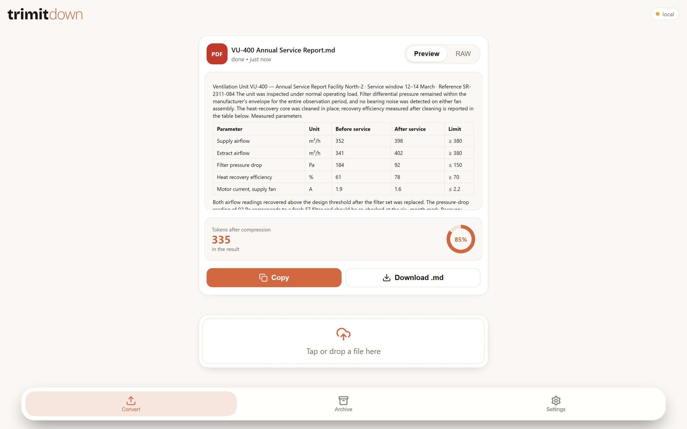
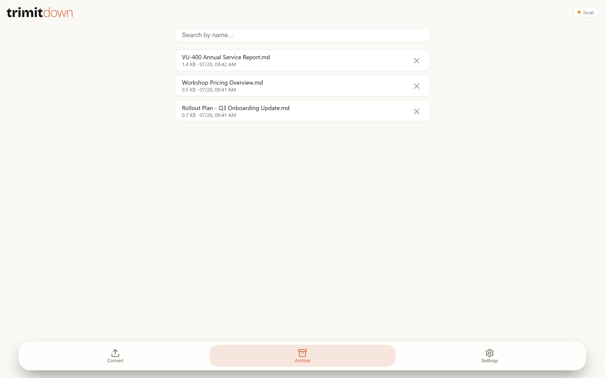
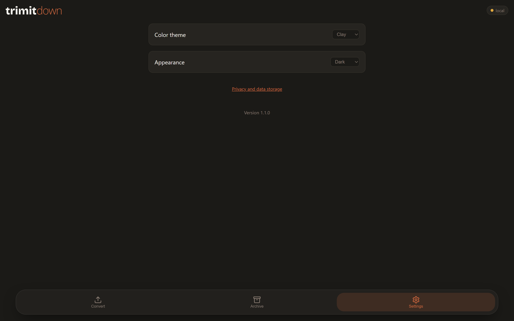
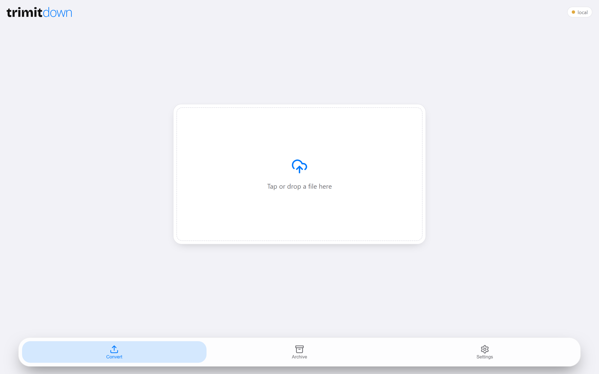
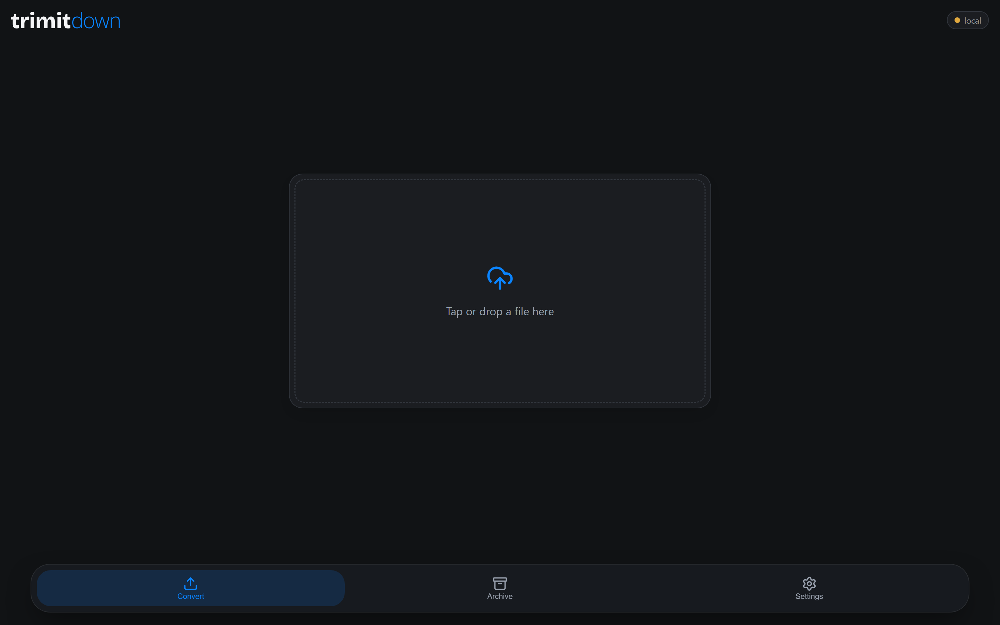

<div align="center">

<picture>
  <source media="(prefers-color-scheme: dark)" srcset="brand/wordmark_dark.svg">
  
</picture>

**Any document → clean, LLM-ready Markdown. On your own server, on every device you own.**

*Read this in: English (this file) · [русский](README.ru.md)*

[](https://github.com/serjdrej/trimitdown/releases/latest)
[](https://github.com/serjdrej/trimitdown/releases)
[](https://github.com/serjdrej/trimitdown/actions/workflows/build-macos.yml)
[](LICENSE)


<picture>
  <source media="(prefers-color-scheme: dark)" srcset="docs/images/result-dark.png">
  
</picture>

</div>

TrimItDown turns PDF, Word (docx), PowerPoint (pptx), Excel (xlsx/xls) and Outlook (.msg)
files into clean, readable Markdown — ready to paste into Claude/ChatGPT, Obsidian, Notion,
or any markdown vault. It runs as an iPhone/iPad app (installed straight from Safari, no App
Store), a portable Windows program, a macOS app, and a self-hosted Docker server — with one
shared archive of conversions across all your devices.

## The PDF engine

Most converters — including the stock [MarkItDown](https://github.com/microsoft/markitdown)
PDF path — stumble on real-world PDFs in three measurable ways: they **glue words together**,
**invent tables out of ordinary prose**, and **drop genuine ruled tables**. On our 700-file
real-world corpus, the stock converter hallucinated tables in 49 files — 2,442 rows of
"table" that were never tables.

So v1.1.0 replaced it with a custom extraction engine:

- **Words split at a measured word-gap threshold** — a fraction of the font size, not a fixed
  point value, so it holds across small print and large headings alike.
- **A dedicated table-detection stage** validates every candidate grid by how its cells are
  actually filled (a row-fill vote), instead of trusting every ruled rectangle. Diagrams and
  decorative frames get rejected; their text flows back into prose instead of vanishing.
- **Genuine ruled tables render as honest Markdown tables**, cell for cell.

The same document, converted by the stock PDF converter and by TrimItDown:

**Stock converter** — a phantom empty column, shifted headers:

```markdown
| Parameter            | Unit | Before service |     | After service | Limit |
| -------------------- | ---- | -------------- | --- | ------------- | ----- |
| Supply airflow       | m³/h |                | 352 | 398           | ≥ 380 |
| Extract airflow      | m³/h |                | 341 | 402           | ≥ 380 |
| Filter pressure drop | Pa   |                | 184 | 92            | ≤ 150 |
```

**TrimItDown** — the table as it appears on the page:

```markdown
| Parameter            | Unit | Before service | After service | Limit |
| -------------------- | ---- | -------------- | ------------- | ----- |
| Supply airflow       | m³/h | 352            | 398           | ≥ 380 |
| Extract airflow      | m³/h | 341            | 402           | ≥ 380 |
| Filter pressure drop | Pa   | 184            | 92            | ≤ 150 |
```

In short: we add the table-*validation* stage that the classic tabula-java pipeline has and
Python extractors lack, expressed as a cell-fill vote on pdfplumber's ruled grids, with
per-grid fallback to prose — no ML models, no cloud, small enough to ship inside a portable
binary. Every non-PDF format still goes through MarkItDown.

## Why TrimItDown

- **Made for the LLM workflow.** Clean Markdown out, a live preview, and a token counter that
  shows what a document will cost before you paste it into a model's context.
- **Your files never leave your infrastructure.** Conversion happens on your own server (home
  NAS, VPS) or fully offline on your computer. No third-party SaaS, no per-page fees.
- **One archive, every device.** Convert on your phone — the result is already on your
  computer, and vice versa. Searchable, with batch conversion and ZIP export.
- **A real app experience everywhere.** iPhone PWA installed from Safari (no App Store), a
  portable Windows exe, a macOS app. Russian and English UI, light/dark, two color themes.

## Get it

| Platform | How |
|---|---|
| **Windows** | Download `TrimItDown-windows-x64.exe` from [Releases](https://github.com/serjdrej/trimitdown/releases/latest) — portable, no install |
| **macOS** (Apple Silicon / Intel) | Download the matching `.zip` from [Releases](https://github.com/serjdrej/trimitdown/releases/latest), unzip, right-click → Open |
| **iPhone / iPad** | Served by your own Docker server — open it in Safari → Share → *Add to Home Screen* |
| **Docker server** | See [Self-hosting](#self-hosting) below |

The desktop apps work fully offline out of the box. Point them at your server in **Settings**
to get the shared archive.

## Self-hosting

The Docker server is the source of truth: it converts, stores the shared archive, and serves
the iPhone PWA.

```bash
git clone https://github.com/serjdrej/trimitdown.git
cd trimitdown/docker-server
# one-time: generate a self-signed HTTPS certificate (copy-paste command in docker-server/README.md)
docker-compose up -d --build
```

Then open `https://YOUR_SERVER:8002`. Full instructions — certificate generation, trusting it
on iOS/Windows/macOS, and the API — in [`docker-server/README.en.md`](docker-server/README.en.md).

## Screenshots

| Archive, shared across devices | Settings |
|---|---|
|  |  |

| Ocean theme, light | Ocean theme, dark |
|---|---|
|  |  |

<!-- TODO: real iPhone screenshots (PWA on the Home Screen / share-sheet flow) go here -->

## How it works

- **The Docker server** is a FastAPI service with HTTPS; the archive lives on the server. The
  same service serves the PWA for iPhone.
- **The Windows/macOS apps** check at startup whether your server is reachable: if yes, they
  open straight on it (shared archive); if not, they spin up a bundled local server and work
  fully offline. The shell is [pywebview](https://pywebview.flowrl.com/) (WebView2 / WKWebView),
  packaged with PyInstaller.
- **Conversion:** PDFs go through TrimItDown's own engine ([`core/pdf_extract.py`](core/pdf_extract.py),
  built on pdfplumber); every other format goes through Microsoft's
  [MarkItDown](https://github.com/microsoft/markitdown).

## Repository layout

- [`core/`](core/) — shared conversion logic and the custom PDF engine
- [`docker-server/`](docker-server/) — the self-hosted service + iPhone PWA
- [`static/`](static/), [`main.py`](main.py), [`server_app.py`](server_app.py) — desktop apps (UI, entry point, offline mode)
- [`tests/`](tests/) — unit tests + a labeled corpus harness for the table-detection stage

## Contributing

Bug reports and PRs are welcome — see [CONTRIBUTING.md](CONTRIBUTING.md).
[DEVELOPMENT.md](DEVELOPMENT.md) documents the dev setup and the desktop build internals.

## Limitations

- The server's self-signed HTTPS certificate needs a one-time manual trust on each device
  (iOS: profile + full trust; Windows: import into `CurrentUser\Root`; macOS: Keychain).
- The binaries aren't code-signed (no Apple/Microsoft developer certificate) — first launch
  needs a one-time override (macOS: right-click → Open; Windows: SmartScreen).

## License and credits

Code is [MIT](LICENSE). Non-PDF conversion is powered by
[MarkItDown](https://github.com/microsoft/markitdown) (Microsoft, MIT); the bundled
third-party licenses are listed in [THIRD_PARTY_NOTICES.md](THIRD_PARTY_NOTICES.md).
